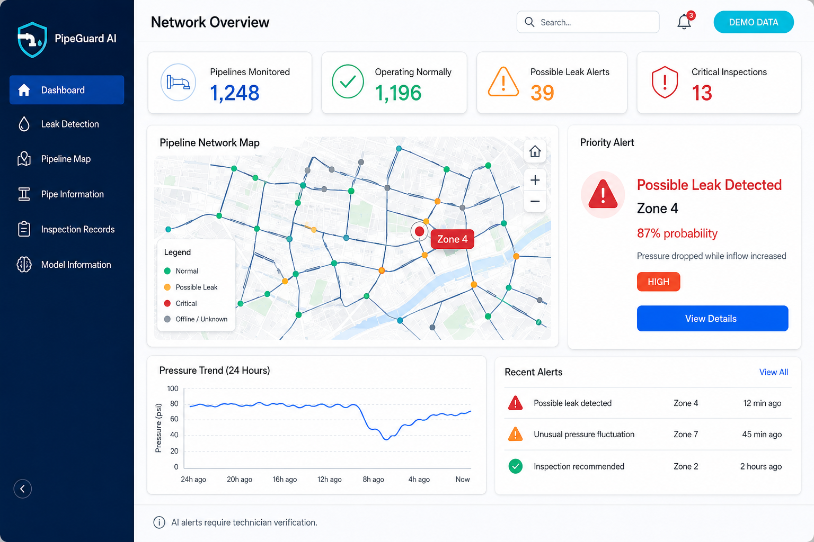
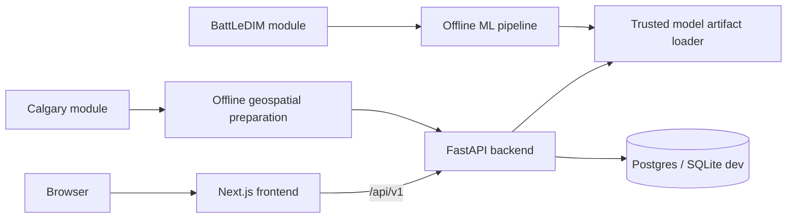

# PipeGuard AI

**Water Leak Detection and Pipeline Inspection Support**

PipeGuard AI is a portfolio-grade, dataset-powered water-utility decision-support
prototype. It replays historical research sensor readings, demonstrates possible
leak early warnings, displays public pipe-asset records and keeps technician
inspection findings separate from AI predictions.

> This is an AI-generated early warning, not a confirmed leak. Technician verification is required.



## Real-world problem

Water utilities need a faster way to review pressure, flow and tank-level changes,
prioritize suspicious zones and organize inspection evidence. PipeGuard AI provides
a research workflow for early-warning triage. It does not replace field inspection,
hydraulic engineering or utility control systems.

## Scientific boundaries

- Pipe age is calculated from the recorded installation year.
- Pressure comes from pressure sensors.
- Flow comes from flow meters.
- Tank level comes from tank-level sensors.
- Possible leaks are inferred from hydraulic sensor patterns.
- Camera records are stored as observations; this project does not diagnose them.
- Acoustic testing can support leak-location investigation.
- Ultrasonic or electromagnetic inspection is required for wall-thickness assessment.
- Hydraulic capacity needs calibrated diameter, length, roughness, elevation, pressure and flow modelling.
- An AI warning is never automatically converted to a confirmed leak.

## Dataset modules

### BattLeDIM L-Town

Used for the sensor research pipeline. The package contains two years of five-minute
pressure, flow, tank-level, demand and leakage-flow records. The uploaded files have:

- 33 pressure sensors
- 3 flow sensors
- 1 tank-level sensor
- 82 demand/AMR channels
- 105,120 timestamps per year
- semicolon separators and decimal commas

The supplied `any active leakage > 0` target is positive for about 97.8% of 2018
and 100% of 2019. Therefore, the latest chronological test period has only one
class. The starter build intentionally blocks model approval rather than publishing
misleading metrics. Demo endpoints remain available and are visibly labelled.

### Calgary public water network

Used separately for pipe inventory, recorded installation year, calculated age,
material, diameter, length and geographic display. It is never row-wise merged with
BattLeDIM. Pressure and flow display as **Not available** unless a valid mapping exists.

The original uploaded dataset package is included at:

```text
data/raw/PipeGuard_AI_Research_Dataset_Pack.zip
```

## Architecture



## Repository

```text
frontend/          Next.js responsive application
backend/           FastAPI, auth, database, validation and tests
ml/                Offline data and modelling modules and notebooks
data/raw/          Original uploaded dataset ZIP
data/demo/         Small safe demonstration and research samples
model_artifacts/   Schema, manifest, demo fixtures and approval status
docs/              Architecture, security, API, deployment and user guide
reports/           Dataset audit and generated reports
scripts/           Dataset setup, audit, training and seed helpers
.github/           CI, CodeQL, security and Dependabot
```

## Quick start

### 1. Extract the dataset

```bash
python scripts/extract_dataset.py
python scripts/audit_dataset.py
```

### 2. Backend

```bash
cd backend
python -m venv .venv
source .venv/bin/activate        # Windows: .venv\Scripts\activate
pip install -r requirements.txt
alembic upgrade head
uvicorn main:app --reload --port 8000
```

API documentation: `http://localhost:8000/docs`

### 3. Frontend

```bash
cd frontend
npm install
cp ../.env.example .env.local
npm run dev
```

Frontend: `http://localhost:3000`

### 4. Full local checks

```bash
bash scripts/check_all.sh
```

## Machine-learning workflow

```bash
python scripts/run_training.py --dataset-dir data/interim/pipeguard_dataset_pack
```

The training pipeline:

1. validates each source module;
2. builds the leakage target from supplied leakage-flow columns;
3. creates current/past-only aggregate features;
4. creates chronological event-aware splits;
5. compares dummy, logistic regression, random forest, histogram gradient boosting and extra trees;
6. reports PR-AUC, event recall, point metrics, false alarms/day, delay and Brier score when valid;
7. approves only when validation and final test requirements are met;
8. hashes and exports the trusted artifact.

With the included target definition, approval is blocked because the final period is
one class. This is recorded in `model_artifacts/artifact_manifest.json`.

## Application pages

- Dashboard
- Leak Detection: demo, manual, CSV and future live architecture
- Pipeline Map
- Pipe Information
- Inspection Records
- Model Information
- About Project
- Technician Login

## API highlights

```text
GET  /api/v1/health
GET  /api/v1/readiness
GET  /api/v1/model/info
POST /api/v1/predict/demo/normal
POST /api/v1/predict/demo/leak
POST /api/v1/predict/manual
POST /api/v1/predict/csv
GET  /api/v1/pipes
GET  /api/v1/map/pipes
GET  /api/v1/inspections
POST /api/v1/inspections
```

Real prediction endpoints return a controlled `MODEL_NOT_AVAILABLE` response until
an approved artifact passes manifest validation. Demo endpoints use static research
fixtures and never claim live monitoring.

## Authentication

Public users can view research pages and use demo/manual/CSV interfaces. Technician
or administrator sessions are required for inspection changes. The implementation
uses Argon2 hashes, signed short-lived HttpOnly cookies, SameSite=Lax, CSRF checks,
role authorization and generic login errors.

## Database migrations

Development defaults to SQLite. For Neon or another Postgres provider:

1. set `DATABASE_URL`;
2. install backend dependencies;
3. run `alembic upgrade head`;
4. run `python ../scripts/seed_demo.py`.

## Tests

```bash
cd backend && pytest
cd frontend && npm test
cd frontend && npm run test:e2e
python -m pytest tests
```

CI also runs Ruff, Black check, Mypy, Bandit, pip-audit, ESLint, TypeScript,
production build, dependency audit, CodeQL and secret-handling checks.

## Vercel deployment

### Recommended Two-Project Monorepo Setup

To deploy PipeGuard AI cleanly on Vercel without framework detection issues:

#### 1. Frontend Vercel Project
1. Import the GitHub repository `PipeGuard-AI` into Vercel.
2. Open **Project Settings** -> **Build & Development Settings**.
3. Set **Root Directory** to `frontend`.
4. Set **Framework Preset** to **Next.js**.
5. Leave **Output Directory** empty (default `.next`).
6. Set **Install Command** to `npm install`.
7. Set **Build Command** to `npm run build`.
8. Add Environment Variable:
   - `NEXT_PUBLIC_API_BASE_URL` = `https://<your-backend-project>.vercel.app`
9. Save settings.
10. Redeploy without using the previous build cache.

#### 2. Backend Vercel Project
1. Import the same GitHub repository into Vercel as a second project.
2. Set **Root Directory** to `backend`.
3. Set **Framework Preset** to **Other** / **FastAPI**.
4. Set Environment Variables:
   - `DATABASE_URL` (Neon Postgres URL)
   - `ALLOWED_ORIGINS` = `https://<your-frontend-project>.vercel.app`
   - `DEMO_TECHNICIAN_PASSWORD`


## Known limitations

- No physical sensors are connected.
- BattLeDIM is simulated benchmark data.
- Calgary records belong to a different water system.
- No approved classifier is included because final chronological evaluation is one class.
- No automated camera diagnosis is implemented.
- Inspection attachments require a production object-storage integration.
- In-memory rate limiting should be replaced by Upstash Redis in multi-instance production.

## Interview explanation

> PipeGuard AI is a hybrid decision-support prototype. I separated sensor research
> data from public asset data, used chronological validation to prevent leakage,
> designed an artifact approval gate, built a versioned FastAPI service, created a
> responsive Next.js interface, and kept AI warnings separate from technician-confirmed
> findings. The project also demonstrates a responsible failure mode: it refuses to
> publish misleading metrics when the latest test period contains only one class.
